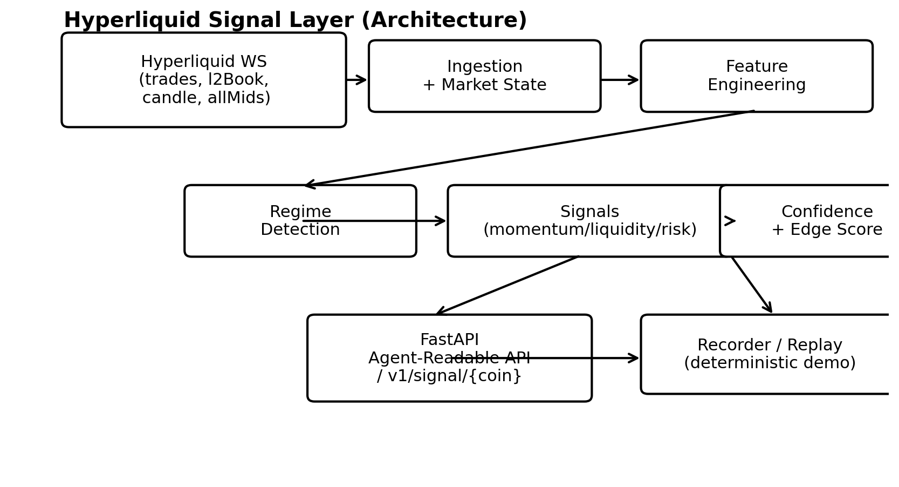

# Hyperliquid Signal Layer

Build an **agent-readable signal layer** for Hyperliquid perpetual markets: ingest real-time WebSocket streams, engineer market-structure features, classify regimes, compute confidence/edge scores, and serve the results via a production-style API.

This repo is designed specifically to prepare for interviews like **“Onchain Signal Infrastructure”** roles.

## Architecture



## What you get

- Real-time **WebSocket ingestion** (trades + L2 book + candle + mids)
- Rolling feature store (microstructure + flow)
- Simple-but-solid **regime classifier**
- **Edge/confidence scoring** with explanations
- **FastAPI** service with strict schemas (Pydantic)
- Optional **replay mode** from NDJSON for deterministic demos/tests

## Hyperliquid endpoints (reference)

- WebSocket (mainnet): `wss://api.hyperliquid.xyz/ws`
- HTTP Info: `POST https://api.hyperliquid.xyz/info`
- Common WS subscriptions: `trades`, `l2Book`, `candle`, `allMids`

## Quickstart

### 1) Create venv + install deps
```bash
python -m venv .venv
source .venv/bin/activate
pip install -r requirements.txt
```

### 2) Run the API (it will start ingestion automatically)
```bash
python -m api.server --coins BTC,ETH,SOL
# open: http://127.0.0.1:8000/docs
```

### 3) Try endpoints
```bash
curl http://127.0.0.1:8000/health
curl "http://127.0.0.1:8000/v1/signal/BTC"
curl "http://127.0.0.1:8000/v1/state"
```

### 4) Optional: deterministic replay mode
Record live data (NDJSON):
```bash
python -m tools.recorder --coins BTC --out data/btc.ndjson --seconds 60
```

Replay it:
```bash
python -m api.server --replay data/btc.ndjson
```

## Testing

Unit tests focus on **regime classification** (the first upstream abstraction):

```bash
pytest -q
```

## Design notes

See **DESIGN.md** for the rationale behind each signal and regime choice.

## Agent-readable output contract

The service emits stable, semantically meaningful objects:

```json
{
  "timestamp_ms": 1710001234567,
  "coin": "BTC",
  "regime": { "label": "TRENDING", "confidence": 0.88 },
  "signals": { "momentum": 0.63, "liquidity": 0.74, "risk": 0.21 },
  "edge": { "score": 0.69, "actionable": true, "explain": ["trend+flow", "stable regime", "good liquidity"] }
}
```

## How to talk about this in an interview

- **Why not raw data?** Raw data shifts complexity downstream and creates brittle agents. A signal layer encodes market structure, regime context, and confidence explicitly.
- **Regime shifts:** Detect via volatility expansion + depth decay + flow chaos; treat liquidation-like conditions as a separate regime.
- **Confidence:** Reward signal agreement + regime stability + liquidity sufficiency; penalize chaotic/illiquid states.

## Project structure

```
hyperliquid-signal-layer/
├── ingestion/          # websocket client + state
├── features/           # microstructure + flow features
├── models/             # regime classifier
├── scoring/            # edge score + explanations
├── api/                # FastAPI server + schemas
├── schemas/            # JSON schema snapshot
├── tools/              # recorder + replay utilities
└── data/               # (optional) ndjson captures
```

## Notes

- This is a *data + signals* project. It does **not** place live trades.
- All computations are intentionally lightweight and explainable (interview-friendly).
